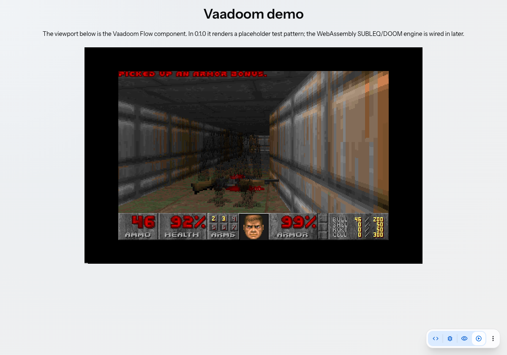
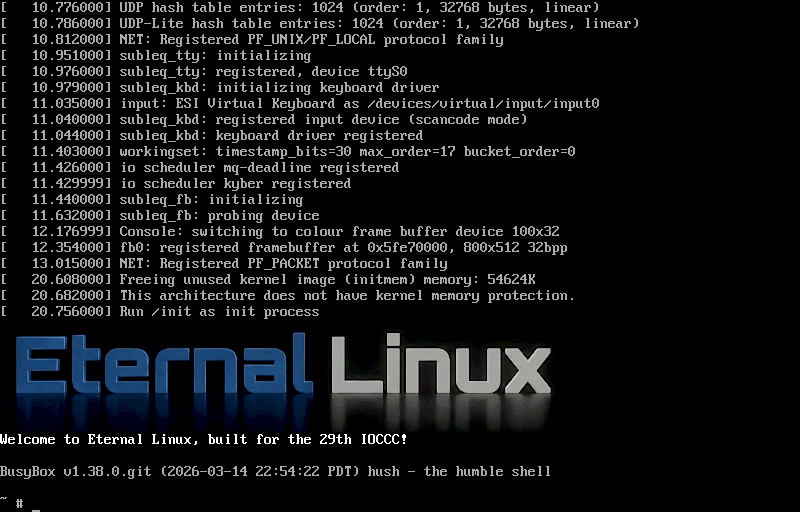
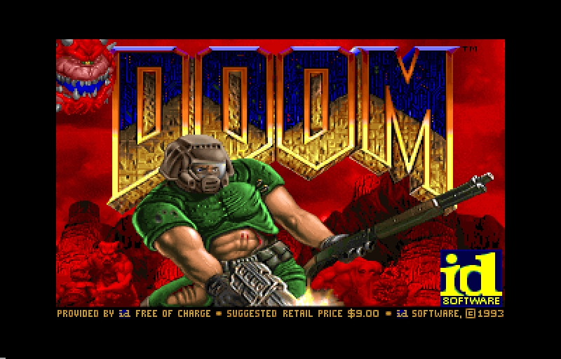

# Vaadoom

**DOOM, as a Vaadin Flow component.**

Vaadoom renders a DOOM viewport inside an ordinary [Vaadin](https://vaadin.com) Flow
`Component`. Under the hood DOOM runs on a NOMMU Linux that itself runs on Adrian Cable's
single-instruction **SUBLEQ** virtual machine — compiled to WebAssembly and driven from a
Web Worker that paints the emulated framebuffer onto an `OffscreenCanvas`.

```java
Vaadoom doom = new Vaadoom(Vaadoom.SHAREWARE_WAD);
add(doom);
```

The constructor takes the URL of the **WAD to play**. `SHAREWARE_WAD` is id Software's
freely redistributable shareware `doom1.wad` on the Internet Archive; pass any other IWAD
URL to play that game instead (see [The WAD](#the-wad)). The WebAssembly engine and the
compressed Linux+DOOM boot image ship inside the add-on JAR, so the WAD is the only thing
fetched from elsewhere — and even that is optional, since the image carries the shareware
WAD as a fallback.



## How it works

```
<vaadoom-viewport> (Lit)          ← plays the PCM blocks (AudioContext)
   │ transferControlToOffscreen()   ↑
   ▼                                │ postMessage({pcm, rate})
Web Worker ── vaadoom.js + vaadoom.wasm   (the SUBLEQ VM)
   • fetch the WAD, hand it to the engine's host-file device
   • decompress the bundled image → MEMFS /boot.img   (DecompressionStream, gzip)
   • boot NOMMU Linux; its init launches fbdoom itself
   • run the VM in bounded slices; paint each frame to the OffscreenCanvas
```

### The WAD

The engine gives the guest a **host-file device**: five zero-page MMIO registers the
guest programs to have the *host* memcpy a slice of the WAD straight into guest RAM
(`native/em_devices.h`). In the guest, `drivers/char/subleq_wad.c` exposes that as a
read-only `/dev/wad`, and the initramfs `init` symlinks DOOM's IWAD to it — so a 4 MB WAD
is played by a machine that executes one instruction, without that machine ever copying
the file. The device registers are ordinary reserved zero-page words, so the same boot
image still runs on a plain CableVM that has no such device.

Which game a WAD is depends on its *file name* in vanilla DOOM (`IdentifyVersion()`), so
the worker reads the lump directory and picks the right one: `MAP01` → `doom2.wad`,
`E4M1` → `doomu.wad`, `E2M1` → `doom.wad`, otherwise `doom1.wad`.

If you own DOOM, The Ultimate DOOM, DOOM II or Final DOOM, host that WAD yourself and
pass its URL — serving it from your own Vaadin application needs no CORS setup, a
cross-origin URL must send `Access-Control-Allow-Origin`. Those IWADs are not freely
redistributable, so this project links only to the shareware one.

**Sound.** DOOM's sound effects are audible. The guest writes PCM frames into a ring in
its own RAM and rings an MMIO doorbell; the engine drains that ring on the VM's timer tick
and the page plays the blocks through the Web Audio API (~150 ms behind the action). The
guest also drives an OPL3 register port for music — the host does not synthesize those
registers yet, so music is still silent. Turn SFX off with `doom.setSound(false)`.

**Playable.** When the component has focus it forwards keyboard input to DOOM —
**arrows** move, **Ctrl** fires, **Space** uses/opens, **Alt** strafes, **1–7** pick weapons,
**Esc** opens the menu. Input is delivered between VM slices, so it uses **no**
`SharedArrayBuffer` and the consuming app needs **no** `COOP`/`COEP` cross-origin-isolation
headers. Disable input via `doom.setPlayable(false)` for a render-only attract loop.

<p float="left">
  
  
</p>

## Requirements

- Vaadin **25.2+**, Java **21+**
- A browser with `OffscreenCanvas`, `WebAssembly` and `DecompressionStream` (current
  Chrome/Edge/Firefox/Safari)
- First paint of DOOM takes ~15 seconds (boot + launch) behind a loading overlay;
  the engine uses up to ~1.5 GB of WebAssembly memory.

## Usage

```xml
<dependency>
    <groupId>org.vaadin.addons.enverhaase</groupId>
    <artifactId>vaadoom</artifactId>
    <version>1.1.0</version>
</dependency>
```

```java
import org.vaadin.addons.enverhaase.vaadoom.Vaadoom;

Vaadoom doom = new Vaadoom(Vaadoom.SHAREWARE_WAD);  // sized to the native 800x512 framebuffer
doom.setWidth("100%");                              // or scale it — HasSize
doom.setSound(false);                               // optional: mute the SFX
add(doom);

// A WAD you own, served by your own application (no CORS setup needed):
add(new Vaadoom("/wads/doom2.wad"));
```

## Building

```bash
./native/build.sh wasm     # compile the SUBLEQ VM to WebAssembly (needs emsdk)
./native/build.sh test     # node self-test of the sound + host-file devices
./native/build.sh image    # fetch + repack the upstream Linux+DOOM image (~38MB gz)
./native/build.sh native   # optional: the unchanged native SDL3 binary (needs SDL3)
mvn                        # run the demo view at http://localhost:8080/
mvn clean install -Pdirectory   # build the Vaadin Directory .zip in target/
```

The **shipped** boot image is not the upstream one: it is built from
<https://github.com/enver-haase/eternal> (`WITH_SOUND=1 ./build-arch.sh cable-nommu`),
whose kernel adds the `subleq_sound` and `subleq_wad` drivers and whose fbdoom has sound
backends. `vmlinux.bootimage.json` next to the image tells the worker what that image
supports (self-launching init, sound, host file), so a different image can be dropped in
without touching the component.

The `native/` source is one file (`vm.c`) with a `#ifdef __EMSCRIPTEN__` seam, so the
same source builds both the browser engine and the original native SDL3 binary.

## Credits & license

Vaadoom's own code is **MIT** licensed ([LICENSE](LICENSE)). The SUBLEQ VM is derived
from Adrian Cable's IOCCC 2025 *cable* entry and the
[`eternal`](https://github.com/adriancable/eternal) project (MIT). The bundled boot image
redistributes the DOOM/**fbdoom** engine and id Software's shareware `doom1.wad`
(© id Software), plus the Linux kernel and BusyBox (GPLv2) and uClibc-ng (LGPLv2.1) —
built from modified sources, for which corresponding source is offered.
Full notices, license texts and the corresponding-source offer are in
[THIRD_PARTY_NOTICES.md](THIRD_PARTY_NOTICES.md). DOOM is a trademark of id Software LLC.
